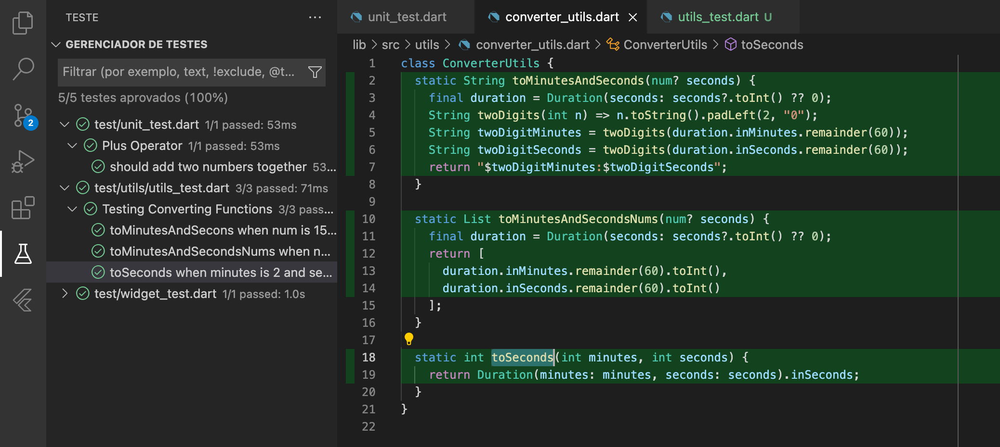
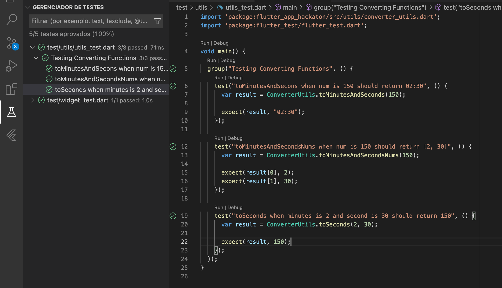

#  Desafio Hacka Flutter 

**Objetivo:** Tabata é um treino intervalado de alta intensidade, que tem sido muito utilizado por atletas do crossfit. 

**Contribuidores** 

Abner Escocio

Mateus Nobre

Pablo Rodrigues

***

💻 Technologies:
✓ VSCode - Android Studio - Dart - Flutter

📚 Relevant tecnlogies used

📌 Firebase - Firestore

📌 Design pattern(BLoC )

📌 Testes Unitários 

📌 Splash Screen with Json file

📌 App Animation

## Apresentação do APP:

📌 Unit tests

